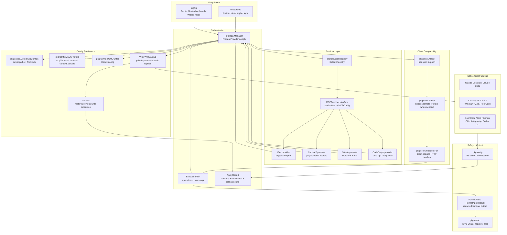

# Universal MCP Sync

[](https://github.com/nawodyaishan/universal-mcp-sync/releases)
[](https://github.com/nawodyaishan/universal-mcp-sync/actions/workflows/ci.yml)
[](./LICENSE)

<p align="center">
  
</p>

**Universal MCP Sync** (`usync`) is a local-first MCP configuration manager for developers who use multiple AI clients.

Configure an MCP server once, preview every file that would change, then sync native client config files for Claude Desktop, Claude Code, Cursor, VS Code, Windsurf, Zed, Roo Code, OpenCode, Kiro, Gemini CLI, Antigravity, and Codex CLI.

> [!IMPORTANT]
> **Help grow the supported MCP list.** If you maintain or rely on an MCP server, add it as a provider instead of documenting manual JSON edits. Start with [Adding an MCP Provider](docs/contributors/adding-a-provider.md), implement the `MCPProvider` contract, register it, and cover the client matrix with tests.
>
> Contributor baseline before a provider PR: `make fmt`, `make test`, and `make gitignore-check`. For provider/client compatibility changes, also run `make lint` and `make verify`.

## Supported MCPs

| MCP server | Capability | Transport | Auth shape | Status |
|---|---|---:|---|---|
| **Exa AI Search** | Web search and retrieval for agents | HTTP | API key in URL query | Stable |
| **Context7** | Current library docs and code examples | Streamable HTTP | `CONTEXT7_API_KEY` header | Stable |
| **GitHub** | Repository, issue, and PR workflows | Stdio via `npx` | `GITHUB_PERSONAL_ACCESS_TOKEN` env var | Beta |
| **Tavily Search** | Real-time web search and data extraction | Stdio via `npx` | `TAVILY_API_KEY` env var | Stable |
| **Playwright** | Browser automation through accessibility snapshots | Stdio via `npx` | None | Stable |
| **Kubernetes** | Read-only Kubernetes and OpenShift runtime state | Stdio via `npx` | None; uses kubeconfig/RBAC | Beta |
| **Terraform** | Terraform Registry and HCP Terraform context | Stdio via Docker | None required; operations disabled by default | Beta |
| **CodeGraph** | Semantic code intelligence — call graphs, symbol maps, cross-file deps | Stdio via `npx` | None; fully local | Stable |

The provider system is intentionally generic. New MCP servers are added through `MCPProvider`, then adapted per client through the capability matrix instead of branching the TUI or apply flow.

## Demo

<p align="center">
  
</p>

## Why This Exists

MCP client configuration is fragmented. Each AI client stores different JSON or TOML, uses different root keys, and handles transports differently. Manually copying credentials into those files is slow, hard to review, and easy to get wrong.

> [!NOTE]
> **Terraform-inspired:** `usync` borrows Terraform's provider pattern and `init -> plan -> apply` workflow. The core setup, preview, and apply path stays generic while each MCP provider owns its credentials, validation, and generated transport config.

`usync` focuses on the native-config sync path:

- **Two guided modes**: Doctor Mode for system-aware setup and Wizard Mode for direct provider-first setup.
- **Dry-run first** so users see exact target files, actions, and redacted credentials before writes.
- **Client-aware output** for `mcpServers`, `servers`, `context_servers`, `httpUrl`, `serverUrl`, TOML, and stdio bridges. Clients that use JSONC (JSON with comments) are handled transparently — existing comments are preserved on write.

- **Local safety controls** with redaction, same-directory backups, atomic writes, rollback, and verification.
- **Provider architecture** for adding more MCP servers without special-casing the UI.

## Quick Start

### Install

macOS with Homebrew:
```bash
brew tap nawodyaishan/homebrew-tap
brew install usync
```

From source:
```bash
git clone https://github.com/nawodyaishan/universal-mcp-sync
cd universal-mcp-sync
make build
./bin/usync --help
```

Requirements for source builds:
- Go 1.23+
- macOS or Linux for full local client path detection

### Choose A Mode

Run `usync` to open the interactive dashboard:
```bash
usync
```

If you built from source:
```bash
./bin/usync
```

The first screen lets you choose between two workflows:

- **Doctor Mode** scans installed AI clients, checks runtimes and existing MCP config paths, highlights conflicts, then guides provider selection, credential entry, target selection, plan preview, and apply.
- **Wizard Mode** is the direct guided setup flow for users who already know the provider, credentials, and target clients they want to configure.

Doctor Mode is the recommended default for real machines because it starts from the current system state. Wizard Mode is still useful for a fast provider-first setup or test fixture flow.

### Doctor Mode

Start from the dashboard and choose Doctor Mode:
```bash
usync
```

Doctor Mode walks through:

1. Scan installed clients, config files, runtime dependencies, and conflicts.
2. Choose an MCP provider and validate credentials.
3. Select target client config files, including optional workspace/project targets.
4. Review a saved plan with redacted credentials and approval prompts.
5. Apply with backups, rollback safeguards, verification, and a follow-up scan.

For a read-only terminal report without launching the TUI:
```bash
usync doctor
usync doctor --verbose
usync doctor --json
```

Useful filters:
```bash
usync doctor --clients cursor,vscode,codex-cli
usync doctor --workspace /path/to/project
usync doctor --no-runtimes
```

`usync doctor` exits with code `2` when it finds warnings, conflicts, missing runtimes, malformed config, or other actionable findings.

### Wizard Mode

Open the guided setup wizard directly:
```bash
usync --wizard
```

Wizard Mode lets you choose a provider, enter credentials, select clients, assign credential profiles, preview the plan, and apply when ready. It uses the same provider architecture and apply safeguards as the rest of the app.

### Preview And Apply From CLI

For automation, use the saved-plan flow. It is provider-neutral and mirrors the interactive Doctor Mode pipeline.

Create a plan for selected targets:
```bash
usync plan \
  --provider exa \
  --keys-file ./exa_keys.txt \
  --targets cursor,vscode,codex-cli \
  --out ./usync-plan.json
```

Or let Doctor Mode discovery select every high/medium-confidence target:
```bash
usync plan \
  --provider exa \
  --keys-file ./exa_keys.txt \
  --all-detected \
  --out ./usync-plan.json
```

Review the saved plan:
```bash
usync show ./usync-plan.json
```

Dry-run the apply preflight:
```bash
usync apply --plan ./usync-plan.json --dry-run
```

Apply only after the preview is correct:
```bash
usync apply --plan ./usync-plan.json
```

Use `--auto-approve` only in trusted automation after reviewing the plan:
```bash
usync apply --plan ./usync-plan.json --auto-approve
```

The older Exa-only compatibility path still works:
```bash
usync sync --keys-file ./exa_keys.txt --dry-run
```

Example redacted preview:
```text
MCP sync plan
=============
- Claude Desktop: Claude Desktop config
  credential: exa_****abcd
  path: ~/Library/Application Support/Claude/claude_desktop_config.json
  backup: .../claude_desktop_config.json.bak-usync-20260509-084228
```

Apply with the compatibility path:
```bash
usync sync --keys-file ./exa_keys.txt --apply
```

## Supported Clients

`usync` detects and updates native config files for these macOS and Linux targets:

| Client | macOS target | Linux target |
|---|---|---|
| Claude Desktop | `~/Library/Application Support/Claude/claude_desktop_config.json` | `~/.config/Claude/claude_desktop_config.json` |
| Claude Code | Managed through `claude mcp` CLI when available | Managed through `claude mcp` CLI when available |
| Cursor | `~/.cursor/mcp.json` | `~/.cursor/mcp.json` |
| VS Code | `~/.vscode/mcp.json` | `~/.config/Code/User/mcp.json` |
| Windsurf | `~/.codeium/windsurf/mcp_config.json` | `~/.codeium/mcp_config.json`, with existing `~/.codeium/windsurf/mcp_config.json` preserved |
| Zed | `~/.config/zed/settings.json` | `~/.config/zed/settings.json` |
| Roo Code | `~/Library/Application Support/Code/User/globalStorage/saoudrizwan.claude-dev/settings/mcp_settings.json` | `~/.config/Code/User/globalStorage/saoudrizwan.claude-dev/settings/mcp_settings.json` |
| OpenCode | `~/.opencode.json` | `~/.config/opencode/opencode.json` |
| Kiro | `~/.kiro/settings/mcp.json` | `~/.kiro/settings/mcp.json` |
| Gemini CLI | `~/.gemini/settings.json` and `~/.gemini/mcp_config.json` | `~/.gemini/settings.json` |
| Antigravity | `~/.gemini/config/mcp_config.json` | `~/.gemini/config/mcp_config.json` |
| Codex CLI | `~/.codex/config.toml` | `~/.codex/config.toml` |

A dry run always shows the exact path on your machine before any write.

## How It Compares

Several MCP tools solve adjacent problems:

- [MCP Server Manager](https://github.com/sardine-ai/mcp-server-manager) and [mcp-manage](https://github.com/zarrx-dev/mcp-manage) use a gateway-style model where clients connect to one manager process.
- [MCP Router](https://github.com/mcp-router/mcp-router) provides a desktop management layer with projects, workspaces, and broad server connectivity.
- [vlazic/mcp-server-manager](https://github.com/vlazic/mcp-server-manager) centralizes MCP server/client config through a single YAML-backed manager and local web UI.

`usync` is intentionally different: it writes each AI client's native MCP configuration directly. That keeps the runtime path simple for users who want no always-on gateway, while still adding reviewability, credential redaction, backups, and rollback around local config edits.

## Safety Model

- **Read-only diagnosis first**: Doctor Mode and `usync doctor` scan clients, runtimes, paths, and conflicts before planning writes.
- **No writes by default**: TUI review, saved-plan preview, and CLI dry-run/preflight steps show target paths and approval prompts first.
- **Saved plans for automation**: `usync plan` and `usync apply --plan` separate decision-making from mutation and check stale plans before apply.
- **Credential redaction**: API keys, secret URLs, headers, env values, and generated args are redacted in user-facing output.
- **Atomic file updates**: Config files are written through the repo's backup/write path rather than ad hoc in-place edits.
- **Rollback on failure**: If an apply sequence fails after earlier writes, `usync` attempts to restore previous files.
- **Verification**: Tests cover provider output, client adaptation, JSON/TOML mutation, redaction, rollback, and scenario-level config shapes.
- **QA coverage**: The suite combines unit, scenario, and CLI/TUI E2E golden tests, with `make coverage-check` enforcing the 60% coverage gate (68.2% in the latest local run).

## Provider Architecture



Every MCP server integrates through this interface:

```go
type MCPProvider interface {
	ID() string
	Name() string
	Description() string
	RequiredCredentials() []CredentialSpec
	GenerateConfig(credentials map[string]string) (MCPConfig, error)
}
```

Typical provider work:

1. Implement `pkg/provider/<name>.go`.
2. Register it in `DefaultRegistry()` in `pkg/provider/registry.go`.
3. Add transport support or bridge behavior in `pkg/client/`.
4. Extend JSON/TOML writers only when an existing format cannot persist the provider safely.
5. Add provider, redaction, client adaptation, config writer, and QA scenario tests.

See [Adding an MCP Provider](docs/contributors/adding-a-provider.md) for the full checklist.

## Go Library Usage

The core logic is available under `pkg/`. The API is pre-stable and may change before v2.0.

```go
import (
	"fmt"

	"github.com/nawodyaishan/universal-mcp-sync/pkg/app"
	"github.com/nawodyaishan/universal-mcp-sync/pkg/config"
	"github.com/nawodyaishan/universal-mcp-sync/pkg/provider"
)

func main() {
	manager, err := app.NewManager("/custom/home", nil, nil)
	if err != nil {
		panic(err)
	}

	prov := provider.NewContext7Provider()
	profiles := []provider.CredentialProfile{{
		ProviderID: prov.ID(),
		Values:     map[string]string{"CONTEXT7_API_KEY": "YOUR_SECRET_KEY"},
		Label:      "docs",
	}}

	selected := map[config.AppID]bool{config.AppCursor: true}
	assignments := map[config.AppID]int{config.AppCursor: 0}

	plan, err := manager.PrepareProvider(prov, profiles, selected, assignments)
	if err != nil {
		panic(err)
	}

	result, err := manager.Apply(plan)
	if err != nil {
		fmt.Printf("apply failed: %v\n", err)
	}
	fmt.Printf("updated %d targets\n", len(result.UpdatedTargets))
}
```

## Development

Requirements:
- Go 1.23+
- macOS or Linux for real local config path testing
- `golangci-lint` for `make lint`
- Lefthook is optional but recommended for local pre-commit checks

Common commands:
```bash
make tidy          # sync module dependencies
make tidy-check    # verify go.mod/go.sum are already tidy
make fmt           # format Go sources
make vet           # run go vet
make lint          # run golangci-lint
make test          # run all tests with repo-local caches
make test-e2e      # run CLI/TUI end-to-end golden tests
make coverage-check # enforce the 60% total coverage gate
make build         # build ./bin/usync
make verify        # run local CI guard
make gitignore-check # verify important fixtures are tracked/ignored correctly
```

UX bug-hunting loop:
```bash
make record                              # drive a failing flow; transcript lands in artifacts/journeys/
make replay TRANSCRIPT=… FIXTURE=…      # replay a transcript against a uxexplore fixture
make ux-explore                          # run the full state-space explorer pipeline and gate (must exit 0)
```

`make ux-explore` enumerates every reachable `(screen × precondition)` state, probes every footer key, checks invariants I-01..I-17, and fails CI on any new dead-end or silent no-op finding without a matching justified matrix row.

Install Git hooks:
```bash
brew install lefthook  # or install from your OS package manager
lefthook install
```

## Contributing

Start with [CONTRIBUTING.md](CONTRIBUTING.md). Useful contributor docs:

- [Adding an MCP Provider](docs/contributors/adding-a-provider.md)
- [Dogfooding with Exa and Context7](docs/contributors/dogfooding-with-exa-context7.md)
- [QA and Usability Strategy](docs/roadmap/qa-usability-strategy.md)
- [E2E Testing Workflow](docs/contributors/e2e-testing-workflow.md)

Before opening a PR, run:
```bash
make fmt
make test
make gitignore-check
```

Run `make lint` and `make verify` when changing shared logic, release tooling, or provider/client compatibility.

## Documentation

- [Project Specification](docs/specification.md)
- [Sync Engine Design](docs/architecture/sync-engine-design.md)
- [Architecture Upgrade Plan](docs/specs/architecture-upgrade-plan.md)
- [Context7 Provider Spec](docs/specs/providers/add-context7-provider.md)
- [Scalability and Plugin Research](docs/architecture/scalability-research.md)
- [Phase 2 Registry Wizard Roadmap](docs/roadmap/phase-2-registry-wizard.md)
